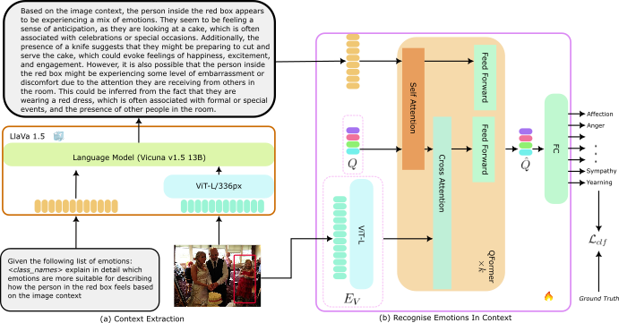

# EmoCommonSense

Authors official PyTorch implementation of the **[VLLMs Provide Better Context for Emotion Understanding Through Common Sense Reasoning](https://arxiv.org/abs/2404.07078)**. If you use this code for your research, please [**cite**](#citation) our paper.

[](https://paperswithcode.com/sota/emotion-recognition-in-context-on-bold?p=vllms-provide-better-context-for-emotion)
[](https://paperswithcode.com/sota/emotion-recognition-in-context-on-caer-1?p=vllms-provide-better-context-for-emotion)
[](https://paperswithcode.com/sota/emotion-recognition-in-context-on-emotic?p=vllms-provide-better-context-for-emotion)

> **VLLMs Provide Better Context for Emotion Understanding Through Common Sense Reasoning**<br>
> Alexandros Xenos*, Niki Maria Foteinopoulou*, Ioanna Ntinou*, Ioannis Patras and Georgios Tzimiropoulos<br>
> *Denotes equal contribution 
> <br>
> 
>
> **Abstract**: Recognising emotions in context involves identifying the apparent emotions of an individual, taking into account contextual cues from the surrounding scene. Previous approaches to this task have involved the design of explicit scene-encoding architectures or the incorporation of external scene-related information, such as captions. However, these methods often utilise limited contextual information or rely on intricate training pipelines. In this work, we leverage the groundbreaking capabilities of Vision-and-Large-Language Models (VLLMs) to enhance in-context emotion classification without introducing complexity to the training process in a two-stage approach. In the first stage, we propose prompting VLLMs to generate descriptions in natural language of the subject's apparent emotion relative to the visual context. In the second stage, the descriptions are used as contextual information and, along with the image input, are used to train a transformer-based architecture that fuses text and visual features before the final classification task. Our experimental results show that the text and image features have complementary information, and our fused architecture significantly outperforms the individual modalities without any complex training methods. We evaluate our approach on three different datasets, namely, EMOTIC, CAER-S, and BoLD, and achieve state-of-the-art or comparable accuracy across all datasets and metrics compared to much more complex approaches.

## Overview

<p alighn="center">
 An overview of our proposed method. We first use LlaVa-1.5, a pre-trained VLLM, to extract language descriptions about the subject's apparent emotion and context (left). The image-description pairs then train our architecture, consisting of a vision encoder ($E_V$), a set of learnable queries ($Q$), a Q-Former module and a Fully Connected layer that performs the final classification on the emotion prediction task. When bounding boxes are available in the annotations, we draw them on the input image so that the model differentiates the subjects and so that the image and generated description are aligned.
</p>

## Notes:

Full code to be released upon publication.

## Acknowledgements

This research utilised Queen Mary's Apocrita HPC facility, supported by QMUL Research-IT. http://doi.org/10.5281/zenodo.438045

## Citation
```bibtex
@article{xenos_vllms_2024,
	title = {{VLLMs} {Provide} {Better} {Context} for {Emotion} {Understanding} {Through} {Common} {Sense} {Reasoning}},
	publisher = {arXiv},
	author = {Xenos, Alexandros and Foteinopoulou, Niki Maria and Ntinou, Ioanna and Patras, Ioannis and Tzimiropoulos, Georgios},
	month = apr,
	year = {2024},
	journal = {arXiv:2404.07078}
}
```
